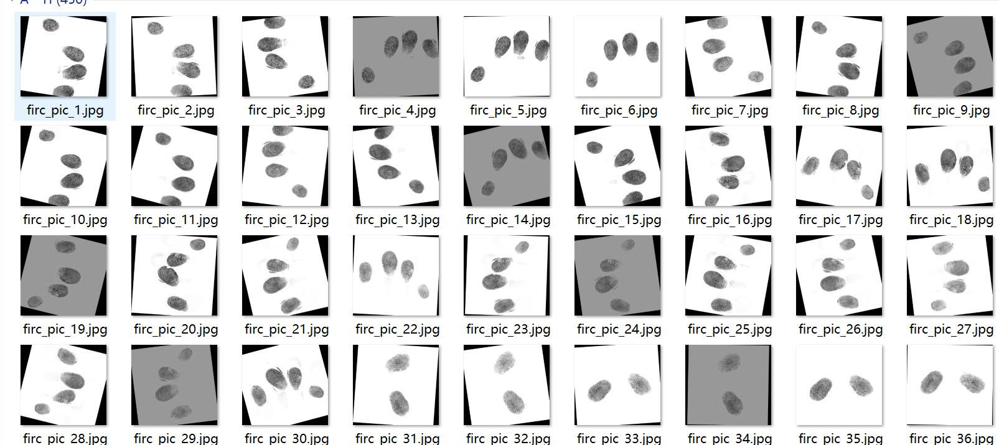
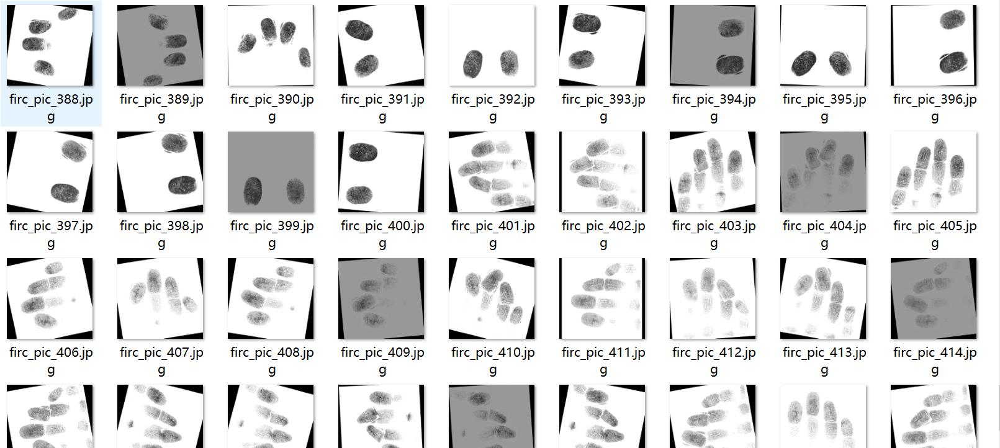
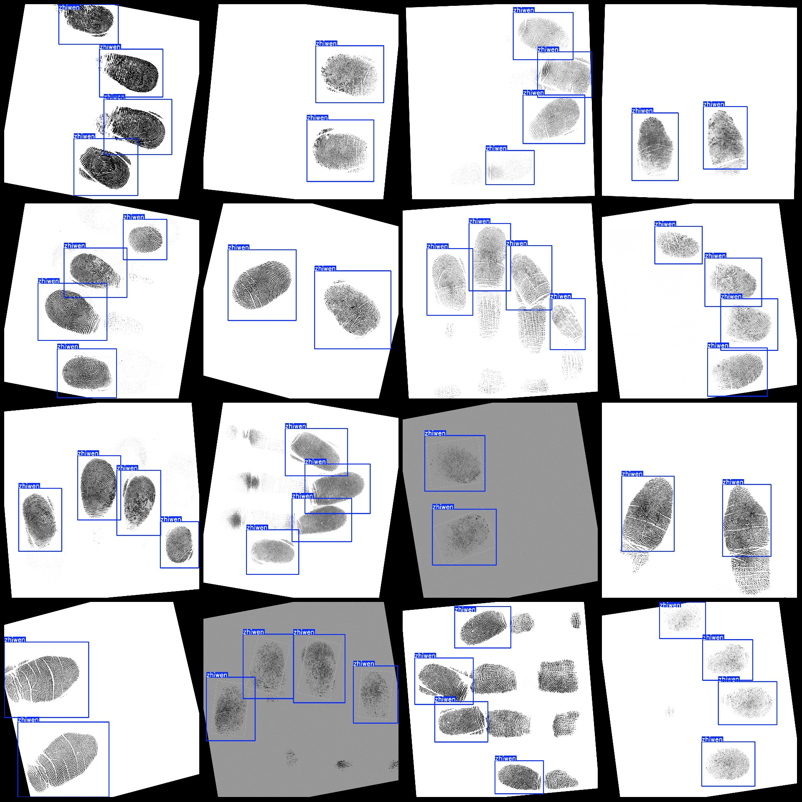
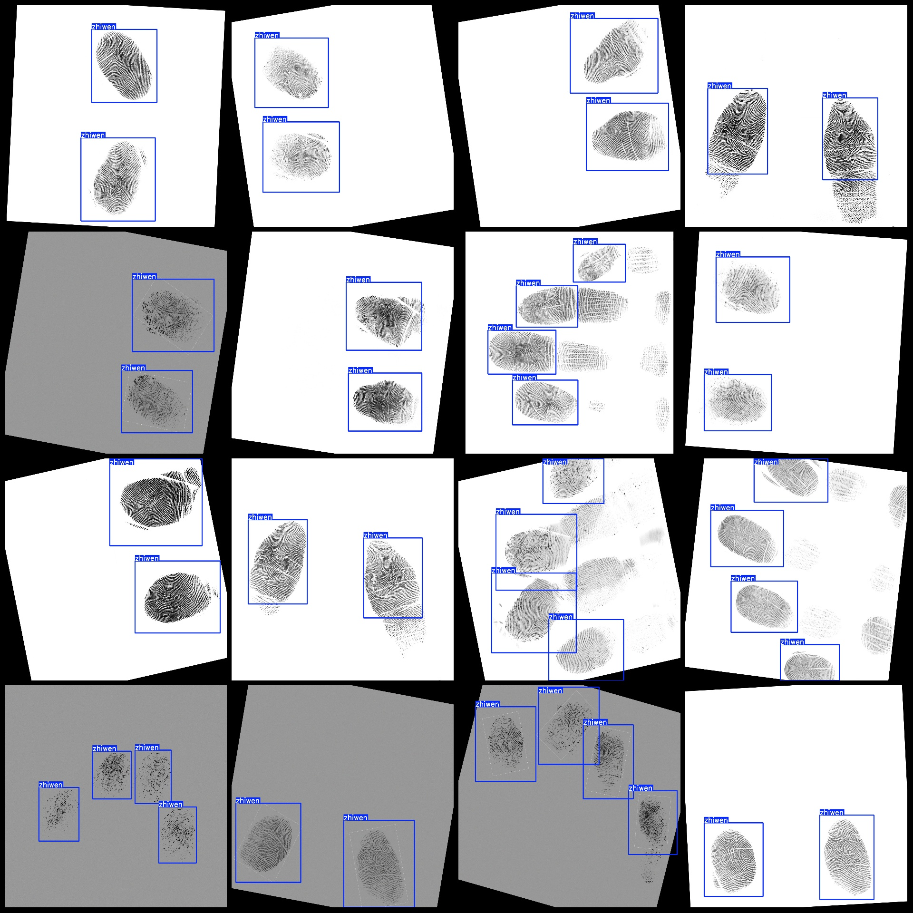

# Fingerprint Detection Dataset VOC+YOLO Format with Enhanced Data

Please note that there are a significant number of enhancements in the dataset. The original image count is about 30, which has been greatly expanded through rotations. Those who are sensitive to 
enhanced images should carefully review the images.
The dataset format: Pascal VOC format + YOLO format (the txt file does not contain the split path, only containing jpg images along with corresponding VOC format xml files and YOLO format txt files).
Number of images (jpg file counts): 450
Number of labeled images (xml file counts): 450
Number of labeled images (txt file counts): 450
Number of labeled categories: 1
Labeled category name: ["zhiwen"]
Number of boxes per category:
zhiwen boxes = 1510
Total boxes: 1510
Number of images per category:
zhiwen images = 450
Image resolution: 1600x1500
Annotation tool used: labelImg
Annotation rules: draw bounding boxes for each category
Important Notice: The dataset does not have a separate training, validation, or test set; it needs to be split manually.
Special Notice: This dataset does not guarantee the accuracy of the trained models or weight files.
Preview of images:
Annotation example:

## Images

Here is a pay link on Stripe ( https://buy.stripe.com/3cs8yP7sY87d0vu9AB ). Please contact me lonlonago@foxmail.com after funding $89, and I will send you a complete data files , thank you!

